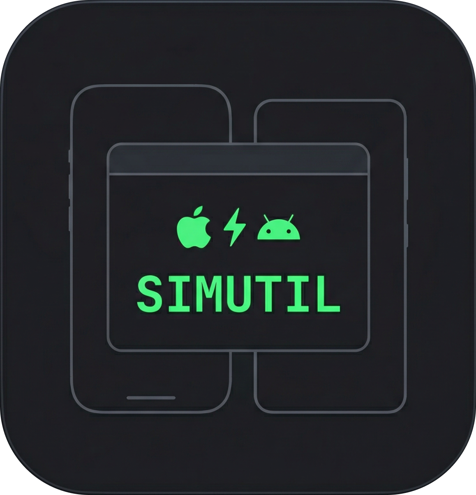

<p align="center">
  
</p>
<h1 align="center">SimUtil</h1>

<p align="center">
  <strong>A terminal UI for launching Android Emulators / iOS Simulators</strong><br>
  <strong>Launch, connect, manage your devices and more — all from the terminal</strong>
</p>

<p align="center">
  <a href="https://www.producthunt.com/products/simutil?embed=true&amp;utm_source=badge-featured&amp;utm_medium=badge&amp;utm_campaign=badge-simutil" target="_blank" rel="noopener noreferrer"></a>
</p>
<p align="center">
  
  <a href="https://github.com/dungngminh/simutil/actions/workflows/ci.yaml"></a>
  <a href="https://github.com/dungngminh/simutil/releases/latest"></a>
</p>

Browse your available emulators and simulators side-by-side, launch with custom options and connect to physical devices wirelessly.

SimUtil runs on macOS, Linux, and Windows. **iOS Simulator support requires macOS** (Xcode / `simctl`); on Linux and Windows the TUI focuses on Android emulators and devices.

Simutil is written with [Nocterm](https://nocterm.dev/), a terminal UI framework for Dart with similar syntax to Flutter.

<p align="center">
  
</p>

<p align="center">
  
</p>

## Features

- **One-Key Launch** — Start any device with `Enter`, no need to open Android Studio or Xcode
- **Android Launch Options** — Provide launch option for Android Emulators: Normal, Cold Boot, No Audio, or Cold Boot + No Audio,...
- **Shutdown device** — Shutdown simulators/emulators.
- **Logcat** — View logcat output of Android emulators / devices, support filtering.
- **ADB Tools Built-in** — Connect to physical Android devices wirelessly:
  - Connect via IP address
  - Pair with 6-digit code (Android 11+)
  - QR code pairing (Android 11+)
- **Custom Plugins** — Add your own external tools (scrcpy, Maestro, etc.) via a YAML file, no code changes needed. Press `p` to pick a plugin and a command to run on the selected device.
- **Edit Config** — Press `e` to open `~/.simutil/settings.yaml` in your default editor (macOS, Linux, Windows).

## Custom Plugins

SimUtil can run external shell-command tools (scrcpy, Maestro, custom scripts, …)
defined in the `plugins:` section of `~/.simutil/settings.yaml` — no code changes
needed. A default file (with `theme`, `last_selected_device_id`, and `scrcpy`) is
created automatically on first launch.

Each plugin groups one or more **commands**. In the app, press `p` on a selected
device to choose a plugin, then a command. Press `e` to edit the config file.
A command can also define a single-key `shortcut` to run it directly. Commands are
filtered to the selected device, and `args` support template variables like
`{device.id}` and `{device.name}`.

```yaml
# ~/.simutil/settings.yaml
theme: dark
last_selected_device_id: ~

plugins:
  - id: scrcpy
    label: scrcpy
    description: Screen mirroring and control for Android
    availability:
      command: scrcpy
      args: [--version]
    commands:
      - id: mirror
        label: Screen Mirror
        command: scrcpy
        args: [-s, "{device.id}"]
        platforms: [android]   # android | ios; empty = any
        requires_running: true # only show when the device is running
        mode: detached         # detached (default) | inherit
        shortcut: s            # optional single key to run directly
```

See the full reference — all fields, template variables, run modes, availability
probes, shortcuts, examples, and troubleshooting — in
**[docs/plugins.md](docs/plugins.md)**.

## Installation

### Binary Install

```bash
curl -fsSL https://raw.githubusercontent.com/dungngminh/simutil/main/install.sh | bash
```

### Binary Install (Windows PowerShell)

```powershell
powershell -ExecutionPolicy Bypass -Command "iwr -useb https://raw.githubusercontent.com/dungngminh/simutil/main/install.ps1 | iex"
```

### Using Homebrew (macOS/Linux)

```bash
brew tap dungngminh/simutil
brew install simutil
```

### From pub.dev

```bash
dart pub global activate simutil
```

### From source

```bash
git clone https://github.com/dungngminh/simutil.git
cd simutil
dart pub get
dart pub global activate --source path .
```

Then run:

```bash
simutil
```

## Supported platforms

SimUtil itself runs on macOS, Linux, and Windows. Feature support depends on the host OS:

| Host OS | Android emulators & devices | iOS simulators & devices |
| ------- | --------------------------- | ------------------------ |
| macOS   | Yes                         | Yes (requires Xcode)     |
| Linux   | Yes                         | No                       |
| Windows | Yes                         | No                       |

iOS support depends on Apple’s tools (`xcrun simctl` for simulators, `xcrun devicectl` for physical devices), which are only available on macOS. On Linux and Windows, the iOS panels indicate they are not supported; Android launch, ADB tools, Logcat, and plugins still work.

## Contributing

```bash
git clone https://github.com/dungngminh/simutil.git
cd simutil
dart pub get
dart run bin/simutil.dart   # Run locally

dart --enable-vm-service bin/simutil.dart # Run with hot reload
```

1. Fork this repository
2. Create a branch and make your changes
3. Open a Pull Request

## License

MIT — see [LICENSE](LICENSE)
