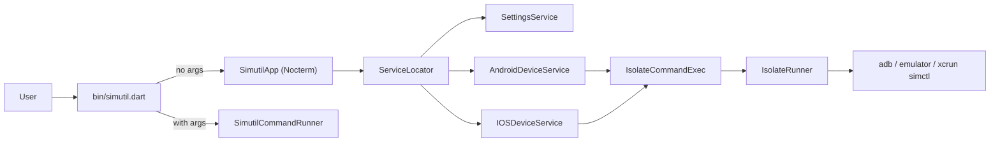

# Architecture

A short tour of `simutil`'s code, intended as progressive disclosure from
[AGENTS.md](../../AGENTS.md). Read alongside the file links — line numbers may
drift but paths are stable.

## Subtree purpose

- [bin/simutil.dart](../../bin/simutil.dart) — entry point. Routes to the TUI
  when called without arguments, otherwise delegates to `SimutilCommandRunner`.
- [lib/simutil_app.dart](../../lib/simutil_app.dart) — root `StatefulComponent`.
  Owns device lists, focus state, the periodic refresh timer, and orchestrates
  every dialog (launch options, ADB tools, logcat).
- `lib/cli/` — `args`-based command runner and subcommands (e.g. `version`).
- `lib/components/` — reusable TUI widgets: panels, dialogs, theme
  (`SimutilTheme`), status bar, header.
- `lib/models/` — plain data: `Device`, `DeviceOs`, `DeviceState`, `DeviceType`,
  `AppSettings`, `AndroidQuickLaunchOption`, `IsolateMessage`.
- `lib/plugins/` — self-contained features.
  - `adb_tools/` — IP connect, pair-code wireless pairing, QR pairing dialogs.
  - `logcat/` — logcat dialog, filter bar, parsing helpers.
  - `scrcpy/` — placeholder for future screen mirroring support.
- `lib/services/` — business logic and side-effects.
  - `service_locator.dart` — singleton DI; the only place services are wired up.
  - `command_exec.dart` — `CommandExec` interface + `IsolateCommandExec` impl.
  - `isolate_runner.dart` — runs shell commands off the UI isolate.
  - `android_device_service.dart` / `ios_device_service.dart` — device discovery,
    launch, shutdown.
  - `settings_service.dart` — load/save `AppSettings` from disk.
- `lib/utils/` — small extensions, constants. **`version.dart` is generated**
  by `build_runner` + `build_version` per [build.yaml](../../build.yaml).
- `test/` — unit tests using `test` + `mocktail`.

## Data flow

Key invariants:

- Services never call `Process.run` directly — they go through `CommandExec` so
  shell work happens on a background isolate and the TUI stays responsive.
- The TUI mutates state via `setState` and refreshes devices on a timer
  (`kReloadInterval`, see [lib/utils/constant.dart](../../lib/utils/constant.dart))
  plus a short follow-up after user actions (`kReloadAfterActionInterval`).
- iOS device discovery is no-op on non-macOS hosts; the iOS panel renders a
  "only supported on macOS" placeholder.
