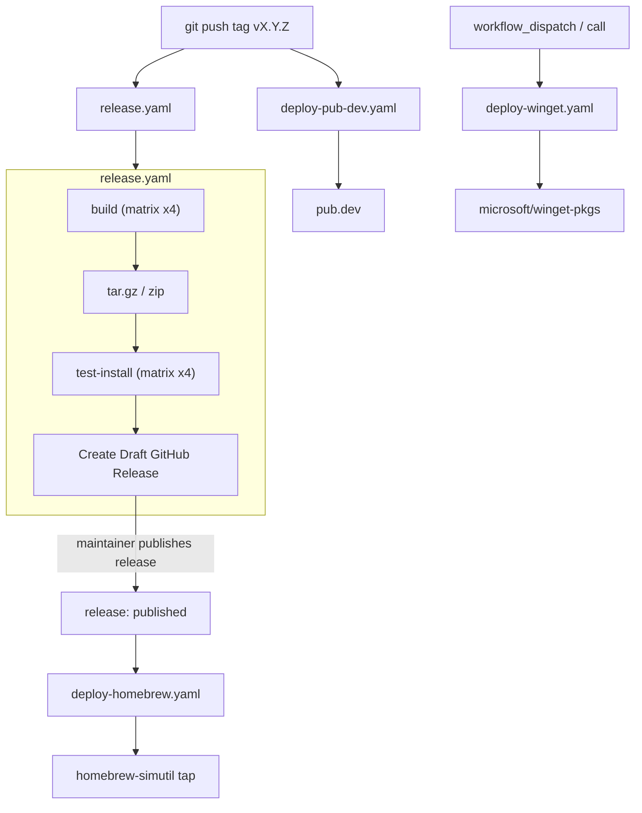

# Deployment

How `simutil` ships. This is the operational view of the workflows under
[.github/workflows/](../../.github/workflows/) — read alongside
[docs/ai/contributing.md](contributing.md), which covers what to do *before*
cutting a release.

## TL;DR

Pushing a tag that matches `v*` triggers two independent workflows in parallel:

- [release.yaml](../../.github/workflows/release.yaml) builds binaries for four
  targets, drafts a GitHub Release, and uploads archives + checksums.
- [deploy-pub-dev.yaml](../../.github/workflows/deploy-pub-dev.yaml) publishes
  the package to [pub.dev](https://pub.dev/packages/simutil).

When the GitHub Release is later **published** (i.e. promoted from draft),
[deploy-homebrew.yaml](../../.github/workflows/deploy-homebrew.yaml) fires and
updates the [`dungngminh/homebrew-simutil`](https://github.com/dungngminh/homebrew-simutil)
tap formula. The WinGet workflow is currently manual / `workflow_call` only.

## Pipeline



## Build matrix (release.yaml)

| Runner          | Target        | Artifact                          |
| --------------- | ------------- | --------------------------------- |
| `ubuntu-latest` | `linux-x64`   | `simutil-linux-x64.tar.gz`        |
| `macos-15-intel`| `macos-x64`   | `simutil-macos-x64.tar.gz`        |
| `macos-14`      | `macos-arm64` | `simutil-macos-arm64.tar.gz`      |
| `windows-latest`| `windows-x64` | `simutil-windows-x64.zip`         |

Each build runner: `dart pub get` → `dart run build_runner build --delete-conflicting-outputs`
→ `dart compile exe bin/simutil.dart -o <artifact>` → archive (`tar -czvf` on Unix,
`Compress-Archive` on Windows). The `test-install` job downloads each archive,
extracts it into a temporary install location, puts it on `PATH`, and runs
`simutil version`. The `release` job then downloads all artifacts, generates
`checksums.txt` via `sha256sum`, and creates a **draft** GitHub Release with
auto-generated notes (categorized per [.github/release.yaml](../../.github/release.yaml)).

## Workflows in detail

### release.yaml

- **Trigger**: `push` of a tag matching `v*`.
- **Output**: draft GitHub Release with four archives + `checksums.txt`.
- **Secret**: `GH_PAT` (used by `softprops/action-gh-release@v2` to create the release).
- Gates the draft release behind `test-install`, which verifies Linux, macOS
  Intel, macOS Apple Silicon, and Windows archives can be installed and run.
- The two `deploy-homebrew` / `deploy-winget` jobs at the bottom are intentionally
  commented out — Homebrew is wired to fire on `release: released` instead, and
  WinGet is manual.

### deploy-pub-dev.yaml

- **Trigger**: tag push (`v*`) **or** `workflow_dispatch`.
- **Auth**: OIDC — uses `id-token: write` to authenticate to pub.dev. No long-lived
  token; the [pub.dev publisher](https://dart.dev/tools/pub/automated-publishing)
  must trust the `dungngminh/simutil` repo.
- Runs `build_runner` so [lib/utils/version.dart](../../lib/utils/version.dart)
  matches `pubspec.yaml` before `dart pub publish --force`.

### deploy-homebrew.yaml

- **Trigger**: GitHub `release: released` (when a draft release is published) or
  `workflow_dispatch`.
- Reads `${GITHUB_REF_NAME}` (e.g. `v0.4.1`) → `VERSION=0.4.1`.
- Downloads the macOS and Linux archives from the release, computes their `sha256`,
  renders [.github/homebrew/simutil.rb.template](../../.github/homebrew/simutil.rb.template)
  with `{{VERSION}}`, `{{ARM64_SHA256}}`, `{{X64_SHA256}}`,
  `{{LINUX_X64_SHA256}}`, and pushes `Formula/simutil.rb` to the
  `dungngminh/homebrew-simutil` tap.
- **Secret**: `HOMEBREW_TAP_TOKEN` — a PAT with `contents: write` on the tap repo.

### deploy-winget.yaml

- **Trigger**: `workflow_call` or `workflow_dispatch` only (the `release: released`
  trigger is commented out).
- Uses [`vedantmgoyal9/winget-releaser@main`](https://github.com/vedantmgoyal9/winget-releaser)
  with `identifier: dungngminh.simutil` and `installers-regex:
  'simutil-windows-x64\.zip$'` to open a PR against `microsoft/winget-pkgs`.
- **Secret**: the default `GITHUB_TOKEN`.

## Cutting a release (maintainer checklist)

1. Move the `[Unreleased]` section in [CHANGELOG.md](../../CHANGELOG.md) under a
   new `[X.Y.Z] - YYYY-MM-DD` heading and re-add an empty `[Unreleased]` block.
2. Bump `version:` in [pubspec.yaml](../../pubspec.yaml) to `X.Y.Z` (this is what
   `build_version` bakes into [lib/utils/version.dart](../../lib/utils/version.dart)).
3. Merge to `main`, then tag and push:

   ```bash
   git tag vX.Y.Z
   git push origin vX.Y.Z
   ```

4. Watch [release.yaml](../../.github/workflows/release.yaml) and
   [deploy-pub-dev.yaml](../../.github/workflows/deploy-pub-dev.yaml) finish
   on the [Actions tab](https://github.com/dungngminh/simutil/actions).
5. Open the draft release on GitHub, edit notes if needed, then **Publish**. That
   is what fires [deploy-homebrew.yaml](../../.github/workflows/deploy-homebrew.yaml).
6. (Optional) Trigger [deploy-winget.yaml](../../.github/workflows/deploy-winget.yaml)
   manually via the Actions tab once the release is live.

## Required repo secrets

| Secret               | Used by                | Purpose                                         |
| -------------------- | ---------------------- | ----------------------------------------------- |
| `GH_PAT`             | `release.yaml`         | Create the draft release with custom notes      |
| `HOMEBREW_TAP_TOKEN` | `deploy-homebrew.yaml` | Push to `dungngminh/homebrew-simutil`           |
| `GITHUB_TOKEN`       | `deploy-winget.yaml`   | Default token for the winget-releaser PR        |

`pub.dev` uses OIDC, no secret required — but the publisher on pub.dev must
authorize this repo + the tag-push event.

## CI (not deployment, but adjacent)

[ci.yaml](../../.github/workflows/ci.yaml) runs on `push`/`pull_request` to
`main` (paths-ignore: `**.md`, `art/**`, `install.sh`):

- `analyze` job: `dart analyze --fatal-infos`.
- `build` job: same four-target matrix as release, but only verifies the
  binary compiles (`dart compile exe`) — no archive, no upload.
