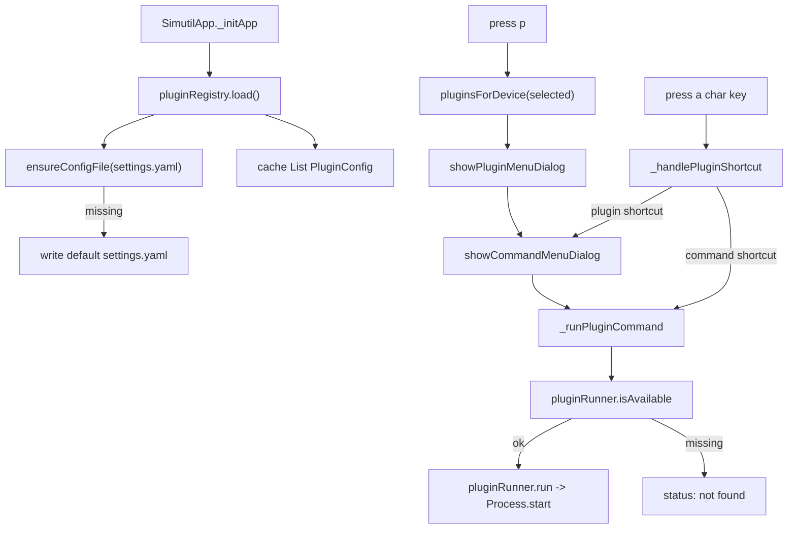

# Plugin system (internals)

How the YAML plugin feature is wired internally. Progressive disclosure from
[architecture.md](architecture.md). For the user-facing schema and examples see
[docs/plugins.md](../plugins.md); keep that doc in sync when changing behaviour.

## What it is

Users register external **shell-command tools** in the `plugins:` section of
`~/.simutil/settings.yaml`. SimUtil parses them at startup, filters by the selected
device, and runs them via `Process.start`. No Dart code changes are needed to add
a tool. Plugins cannot add custom TUI screens — they are command launchers only.

## Moving parts

| File | Role |
| --- | --- |
| [lib/models/plugin_config.dart](../../lib/models/plugin_config.dart) | Data + parsing. `PluginConfig`, `PluginCommandConfig`, `PluginRunMode`, `PluginAvailabilityCheck`, `PluginCommandRef`. Pure Dart, no I/O. |
| [lib/services/user_config.dart](../../lib/services/user_config.dart) | Shared config path, default YAML template, scalar merge helper. |
| [lib/services/plugin_registry_service.dart](../../lib/services/plugin_registry_service.dart) | Load/parse/cache the `plugins:` section; filter by device; resolve shortcuts. |
| [lib/services/settings_service.dart](../../lib/services/settings_service.dart) | Load/save app settings scalars; `openInEditor()` opens config via OS default app. |
| [lib/services/plugin_runner_service.dart](../../lib/services/plugin_runner_service.dart) | Availability probe + launch the process. |
| [lib/plugins/registry/](../../lib/plugins/registry/) | TUI: `plugin_menu_dialog.dart`, `command_menu_dialog.dart`, shared `menu_option_row.dart`. |
| [lib/services/service_locator.dart](../../lib/services/service_locator.dart) | Wires `pluginRegistry` + `pluginRunner`. |
| [lib/simutil_app.dart](../../lib/simutil_app.dart) | Loads the registry on init; handles `p`, dynamic shortcuts, and the two-step flow. |

## Model shape

```
PluginConfig
  id, label, description?, enabled, availability?, shortcut?
  commands: List<PluginCommandConfig>          // non-empty (validated)

PluginCommandConfig
  id, label, command, description?, args[],
  platforms: List<DeviceOs>, requiresRunning, mode, shortcut?, availability?
```

Key methods on the model (no I/O, easy to unit test):

- `PluginCommandConfig.matches(Device?)` — platform + running-state filter.
- `PluginCommandConfig.resolveArgs(Device?)` — interpolates `{device.*}`.
- `PluginConfig.commandsFor(Device?)` / `hasCommandsFor(Device?)`.
- `PluginCommandRef` — pairs a plugin with one of its commands (shortcut /
  selection result).

Parsing throws `FormatException` on invalid entries; required-field and
platform validation lives in the `fromMap` factories.

## Load + flow



Entry points in [lib/simutil_app.dart](../../lib/simutil_app.dart):

- `_initApp` calls `await _di.pluginRegistry.load()` before the first refresh.
- `_handleGlobalKey`: `LogicalKey.keyP` opens `_showPluginMenu`;
  `LogicalKey.keyE` opens `_openSettingsFile` (OS default editor); the `default`
  case forwards single, unmodified character keys to `_handlePluginShortcut`.
- `_showPluginMenu` → `_openCommandMenuForPlugin` → `_runPluginCommand`.

## Behavioural rules (must stay in sync with docs/plugins.md)

- **Availability order:** `command.availability` → `plugin.availability` →
  fallback `<command> --version`. Pass = exit code `0`.
- **Filtering:** a command shows when (`platforms` empty or contains device OS)
  **and** (`requiresRunning` false or device running). A plugin shows when it has
  ≥1 such command. `null` device fails any platform/running constraint.
- **Shortcuts:** normalized to lowercase single keys. Command-level runs
  directly; plugin-level opens that plugin's command menu. Built-in global keys
  (`p`, `e`, `r`, `n`, `l`, `t`, `q`, Tab/arrows/space/enter/esc) are matched before
  the shortcut fallback, so they win.
- **Defaults:** `enabled` true (only `enabled: false` hides), `mode` detached,
  `platforms` empty (any), `requiresRunning` false.
- **Resilience:** duplicate plugin ids are dropped (first wins); invalid entries
  are skipped with a `log(..., name: 'plugins')` warning; a malformed document
  yields an empty list. The app must still start.
- **Templates:** `{device.id|name|platform|os|state}`. `os` uses the enum name
  (`android`/`ios`); `state` uses the label (`Booted`/`Booting`/`Shutdown`).

## Intentional deviation from the CommandExec invariant

[architecture.md](architecture.md) states services never call `Process.run`
directly. Plugin availability probes go through `CommandExec` like other
services. Only plugin **launch** is the deliberate exception:

- Launch uses `Process.start` with `ProcessStartMode.detached` (GUI tools, fire
  and forget) or `inheritStdio` (blocking CLIs).

These are fire-and-forget launches, not captured shell output, so routing them
through `IsolateCommandExec` would add no value. Keep device discovery/launch in
the device services on `CommandExec`; only user plugin launches bypass it.

## Testing

- [test/models/plugin_config_test.dart](../../test/models/plugin_config_test.dart)
  — parse/validate, `matches`, `resolveArgs`, `commandsFor`.
- [test/services/user_config_test.dart](../../test/services/user_config_test.dart)
  — default create, `mergeSettingsScalars`.
- [test/services/plugin_registry_service_test.dart](../../test/services/plugin_registry_service_test.dart)
  — default-file creation, caching, skip/dedupe, filtering, shortcuts, malformed
  input, combined settings file. `PluginRegistryServiceImpl(pluginsFilePath: ...)`
  takes an override path so tests use a temp file instead of `~/.simutil/settings.yaml`.

## Extending — common changes

- **New command field:** add it to `PluginCommandConfig` + `fromMap`, document it
  in [docs/plugins.md](../plugins.md), add a parse test.
- **New template variable:** extend `_interpolate` in
  [plugin_config.dart](../../lib/models/plugin_config.dart) and the variables
  table in [docs/plugins.md](../plugins.md).
- **New run mode:** extend `PluginRunMode` + the `switch` in
  `PluginRunnerServiceImpl.run`.
- **Reload at runtime:** `PluginRegistryService.reload()` already re-reads the
  file; wire it to a key if needed (currently load is startup-only).

## Gotchas

- The default YAML template is the `_defaultPluginsYaml` constant at the bottom
  of [plugin_registry_service.dart](../../lib/services/plugin_registry_service.dart);
  update it when the schema changes so first-run users get a valid sample.
- `omit_local_variable_types`, `prefer_single_quotes`, `require_trailing_commas`
  and `sort_constructors_first` are enforced — mirror the existing model layout
  (constructors first, then fields, then methods).
- Plugin UI dialogs follow the [adb_tools_dialog.dart](../../lib/plugins/adb_tools/adb_tools_dialog.dart)
  pattern (overlay + `Focusable` + ↑/↓/enter/esc). Split large trees into small
  components per [AGENTS.md](../../AGENTS.md).
