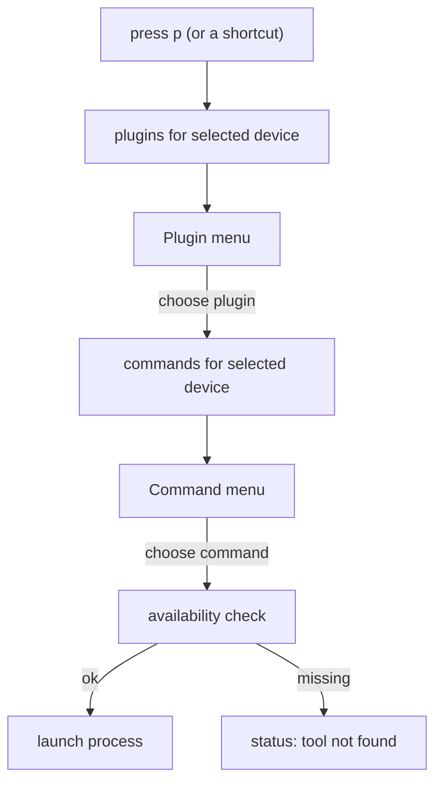

# Custom Plugins

SimUtil can run external command-line / GUI tools (scrcpy, Maestro, Flutter,
adb, custom scripts, …) without any code changes. You describe each tool in a
single YAML file and SimUtil shows it in the UI, scoped to the device you have
selected.

- File location: `~/.simutil/settings.yaml` (plugins live under the top-level `plugins:` key in the same file)
- A default file (containing `theme`, `last_selected_device_id`, and `scrcpy`) is created automatically on first launch.
- Press `e` in the app to open the file in your default editor (macOS, Linux, Windows).
- Edit the file, then restart SimUtil to pick up changes.

## Concepts

A **plugin** is a group of one or more **commands** that share an identity and an
availability probe. For example, a `scrcpy` plugin can expose a `Screen Mirror`
command and a `Screen Mirror (No Audio)` command.

In the app the flow is always:

```
press p  ->  choose a plugin  ->  choose a command  ->  run
```

Plugins and commands are filtered by the **currently selected device**, so you
only ever see what makes sense to run.



## Quick start

1. Launch SimUtil once to generate `~/.simutil/settings.yaml`.
2. Press `e` to open it in your default editor (or edit it manually).
3. Add a plugin under the `plugins:` section (see examples below).
4. Restart SimUtil.
5. Select a device, press `p`, choose your plugin, then a command.

## File format

The config file holds app settings (`theme`, `last_selected_device_id`) and a
top-level `plugins:` list. Each entry is a plugin with a nested `commands:` list.

```yaml
# ~/.simutil/settings.yaml
theme: dark
last_selected_device_id: ~

plugins:
  - id: scrcpy
    label: scrcpy
    description: Screen mirroring and control for Android
    availability:
      command: scrcpy
      args: [--version]
    commands:
      - id: mirror
        label: Screen Mirror
        description: Mirror the device screen
        command: scrcpy
        args: [-s, "{device.id}"]
        platforms: [android]
        requires_running: true
        mode: detached
        shortcut: s

      - id: mirror-no-audio
        label: Screen Mirror (No Audio)
        description: Mirror without forwarding audio
        command: scrcpy
        args: [-s, "{device.id}", --no-audio]
        platforms: [android]
        requires_running: true
        mode: detached
```

### Plugin fields

| Field | Required | Default | Description |
| --- | --- | --- | --- |
| `id` | yes | — | Unique identifier. Duplicate ids are ignored (first one wins). |
| `label` | yes | — | Name shown in the plugin menu. |
| `description` | no | — | Help text shown under the label. |
| `enabled` | no | `true` | Set to `false` to hide the whole plugin. |
| `availability` | no | — | Probe to check the tool is installed (see [Availability](#availability)). |
| `shortcut` | no | — | Single key that opens this plugin's command menu directly. |
| `commands` | yes | — | Non-empty list of commands (see below). |

### Command fields

| Field | Required | Default | Description |
| --- | --- | --- | --- |
| `id` | yes | — | Identifier, unique within the plugin. |
| `label` | yes | — | Name shown in the command menu. |
| `command` | yes | — | Executable to run (must be on your `PATH`). |
| `description` | no | — | Help text shown under the label. |
| `args` | no | `[]` | Argument list. Supports [template variables](#template-variables). |
| `platforms` | no | `[]` (any) | Filter: `[android]`, `[ios]`, or both. Empty means any platform. |
| `requires_running` | no | `false` | Only show when the selected device is running. |
| `mode` | no | `detached` | `detached` for GUI tools, `inherit` for blocking CLIs. |
| `shortcut` | no | — | Single key that runs this command directly. |
| `availability` | no | — | Per-command override of the plugin probe. |

## Template variables

Use these placeholders inside `args`; they are substituted with the selected
device's values at launch time:

| Variable | Example value |
| --- | --- |
| `{device.id}` | `emulator-5554` |
| `{device.name}` | `Pixel 7` |
| `{device.platform}` | `Android` |
| `{device.os}` | `android` / `ios` |
| `{device.state}` | `Booted` / `Booting` / `Shutdown` |

Quote any argument that contains a placeholder or special characters, e.g.
`"--name={device.name}"`.

## Run modes

| Mode | Use for | Behaviour |
| --- | --- | --- |
| `detached` | GUI tools (scrcpy, Maestro Studio) | Process opens its own window and runs independently of SimUtil. |
| `inherit` | Blocking CLIs | Process shares SimUtil's terminal stdio. |

## Availability

Before running, SimUtil checks that the tool exists. The probe is resolved in
this order:

1. The command's own `availability` (if set).
2. The plugin's `availability` (if set).
3. Fallback: `<command> --version`.

A probe passes when the process exits with code `0`. If it fails, SimUtil shows
a "not found" message in the status bar instead of running.

```yaml
availability:
  command: scrcpy
  args: [--version]   # optional; defaults to [--version]
```

## Shortcuts

Shortcuts are single keys, matched case-insensitively, against the selected
device:

- **Command-level** `shortcut` runs that command immediately, skipping both
  menus.
- **Plugin-level** `shortcut` opens that plugin's command menu directly,
  skipping the plugin menu.

Built-in global keys take precedence over plugin shortcuts, so avoid reusing
them: `p` (plugins), `r` (refresh), `n` (ADB tools), `l` (logcat),
`t` (shutdown), `q` (quit), `Tab` / arrows / `space` / `enter` / `esc`.

## Filtering rules

A command is shown for the selected device only when **both** are true:

- `platforms` is empty, or contains the device's OS.
- `requires_running` is `false`, or the device is currently running.

A plugin appears in the plugin menu only if it has at least one command that
passes these rules for the selected device.

## Examples

### Maestro UI testing

```yaml
plugins:
  - id: maestro
    label: Maestro
    description: Mobile UI testing framework
    availability:
      command: maestro
      args: [--version]
    commands:
      - id: studio
        label: Maestro Studio
        command: maestro
        args: [studio, --device, "{device.id}"]
        platforms: [android]
        requires_running: true
        mode: detached

      - id: test
        label: Run Test Flow
        command: maestro
        args: [test, flow.yaml, --device, "{device.id}"]
        platforms: [android]
        requires_running: true
        mode: inherit
```

### Plain adb helpers

```yaml
plugins:
  - id: adb-helpers
    label: ADB Helpers
    description: Handy adb shortcuts
    availability:
      command: adb
      args: [version]
    commands:
      - id: screenshot
        label: Screenshot to /sdcard
        command: adb
        args: [-s, "{device.id}", shell, screencap, -p, /sdcard/screen.png]
        platforms: [android]
        requires_running: true
        mode: inherit

      - id: input-text
        label: Open Settings
        command: adb
        args: [-s, "{device.id}", shell, am, start, -a, android.settings.SETTINGS]
        platforms: [android]
        requires_running: true
        mode: inherit
```

### A custom script

```yaml
plugins:
  - id: my-scripts
    label: My Scripts
    commands:
      - id: deploy
        label: Deploy build
        command: /Users/me/scripts/deploy.sh
        args: ["{device.id}"]
        platforms: [android, ios]
        mode: inherit
```

## Troubleshooting

| Problem | Likely cause |
| --- | --- |
| Plugin not in the menu | Selected device's OS not in `platforms`, or `requires_running: true` while the device is stopped, or `enabled: false`. |
| "not found" status message | The executable isn't on your `PATH`, or the `availability` probe exits non-zero. |
| Command does nothing visible | Using `mode: detached` for a CLI that prints to stdout — switch to `inherit`. |
| Whole file ignored | Invalid YAML. Individual bad entries are skipped with a warning; a malformed document loads no plugins. |
| Changes not applied | Restart SimUtil after editing the file. |

## Limitations

- Plugins run **shell commands only** — they cannot add custom TUI screens.
- No interactive argument prompts before running (planned for a future release).
- Tools must be installed and resolvable via your `PATH`.
